  

  <a href="https://carlashub.com/?utm_source=github&amp;utm_medium=profile&amp;utm_campaign=github_profile">Portfolio &amp; case studies</a>
  &nbsp;·&nbsp;
  <a href="https://www.linkedin.com/in/carla-goncalves-9a01a5164/">LinkedIn</a>
  &nbsp;·&nbsp;
  <a href="https://github.com/CarlasHub?tab=repositories">All repositories</a>

**Carla Goncalves — Web Developer · Accessibility & QA Testing · Automation Tools**

## Some recent work

| Project | About | Links |
| --- | --- | --- |
| **[A11Y Cat Extension](https://github.com/CarlasHub/a11y-cat-extension)** | A Chrome extension that supports accessibility reviews with current-page checks, guided manual evidence, and exportable review data. | [Extension site](https://carlashub.github.io/a11y-cat-extension/) · [Case study](https://carlashub.com/making-a11y-cat-trustworthy/?utm_source=github&utm_medium=profile&utm_campaign=github_profile) |
| **[Accessibility Audit Plugin](https://github.com/CarlasHub/accessibility-audit-plugin)** | A free WCAG 2.2 audit workflow for GitHub Actions and AI coding tools, producing HTML, Excel, JSON, and ZIP evidence. | [Live builder](https://carlashub.github.io/accessibility-audit-plugin/) · [Demo & proof](https://github.com/CarlasHub/accessibility-audit-plugin#demo-and-proof) |
| **[A11Y Test Cases](https://github.com/CarlasHub/a11y-test-cases)** | An open manual-testing manager covering all 55 active WCAG 2.2 Level A and AA success criteria through 165 review steps. | [Live app](https://carlashub.github.io/a11y-test-cases/) · [Case study](https://carlashub.com/a-new-accessibility-test-case-manager/?utm_source=github&utm_medium=profile&utm_campaign=github_profile) |
| **[Agents Workflow Blueprint](https://github.com/CarlasHub/Agents-Workflow-Blueprint)** | Reusable prompts, skills, contracts, and governance patterns for coordinated agent work with explicit boundaries. | [Explore blueprint](https://carlashub.github.io/Agents-Workflow-Blueprint/) · [Case study](https://carlashub.com/how-to-build-a-website-with-ai-agents-without-letting-them-run-wild/?utm_source=github&utm_medium=profile&utm_campaign=github_profile) |
| **[AI-Agent SDLC Boilerplate](https://github.com/CarlasHub/ai-agent-sdlc-boilerplate)** | A governance-first starter covering scope, guardrails, approval gates, evaluations, audit evidence, and local ZIP export. | [Live builder](https://carlashub.github.io/ai-agent-sdlc-boilerplate/) · [Case study](https://carlashub.com/ai-agent-sdlc-boilerplate-governance/?utm_source=github&utm_medium=profile&utm_campaign=github_profile) |
| **[Cat Crawler](https://github.com/CarlasHub/site-crawler)** | A React and Node.js crawler for discovering pages, validating navigation, and producing actionable site-audit reports. | [Product site](https://carlashub.github.io/site-crawler/) · [Case study](https://carlashub.com/cat-crawler-why-i-built-it-what-i-learned/?utm_source=github&utm_medium=profile&utm_campaign=github_profile) |

<!-- Profile links reviewed 2026-09-11. -->
